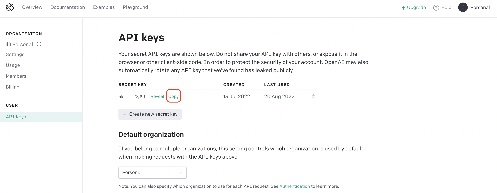
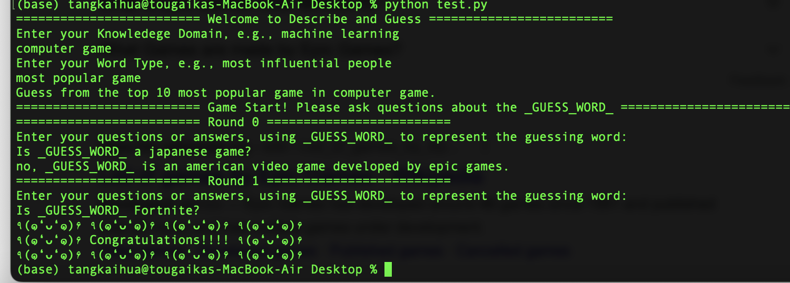

# Describe-and-Guess-Using-GPT-3
A simple demo of how to use GPT-3 to play Describe-and-Guess in the specified topic and question type.

# Introduction
GPT-3 has great utilization potential in the game design. For example, [Ember AI](https://getember.ai/) uses GPT-3 to generate real-time, dynamic conversation for non-player characters in games. In this demo, we use GPT-3 to serve as a knowledge base and an intelligent interface to play the Classic game: Describe and Guess.

# How to use GPT-3
First of all, you need to create an [OpenAI API key](https://beta.openai.com/docs/api-reference/introduction) to access the GPT-3, which can be viewed at the [page](https://beta.openai.com/account/api-keys). 

Then you need to install the openai on your machine using the following command:
```
pip install openai
```

<p align = "center"></p>

# How to play the game

First, you need to specify the knowledege domain and question type.

Next, we will choose a random answer from 10 candidates based on the knowledege of GPT-3.

Then, you can play the game. Note that you only have 10 rounds to ask questions.

Please check the following example to play the game.

<p align = "center"></p>
